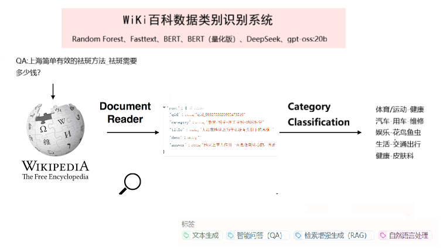
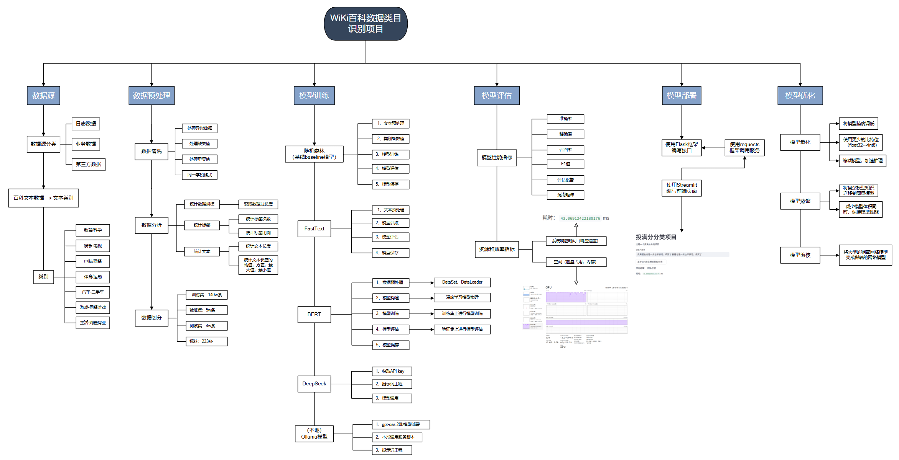
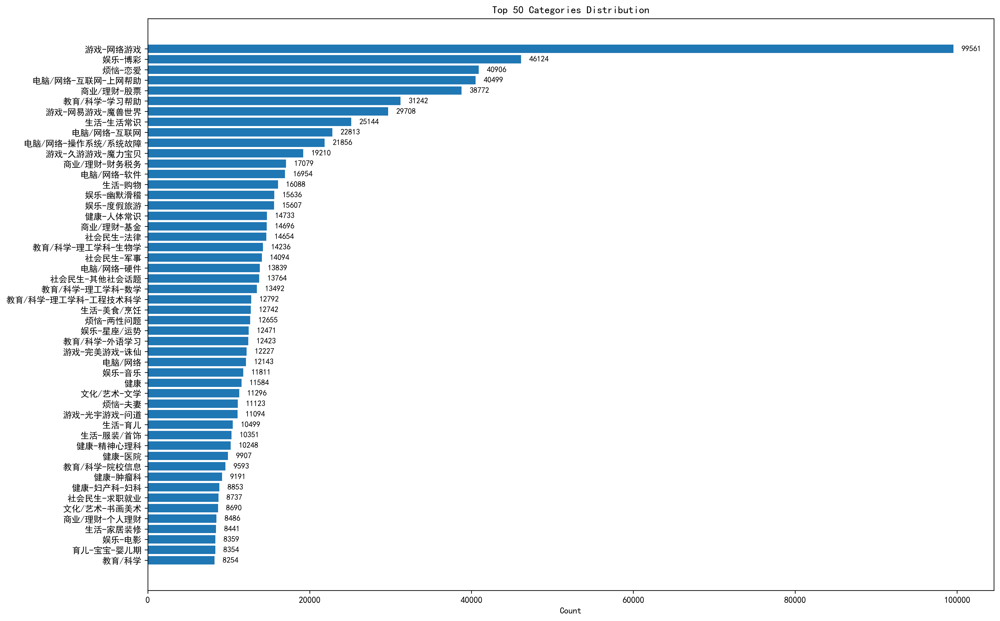
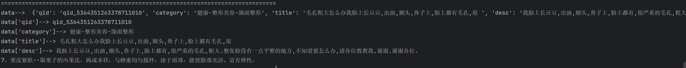
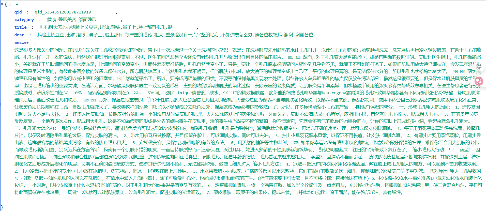
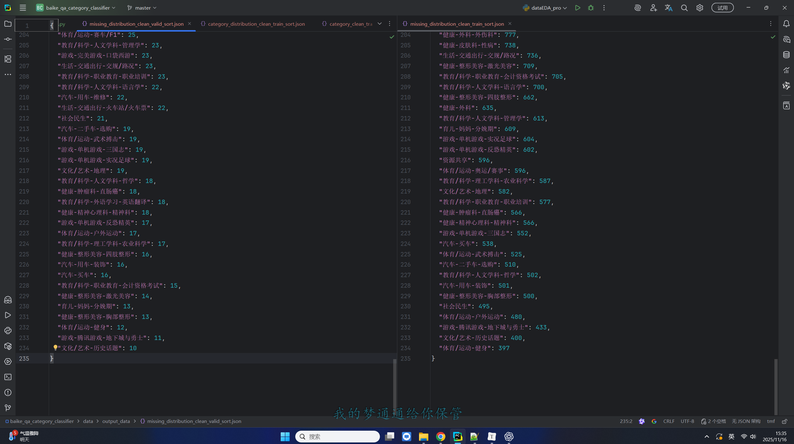

# 一、项目背景



​		随着互联网内容的高速增长，各类在线百科平台、问答社区与知识库系统积累了海量的用户提问与答案内容。这些文本内容涵盖 400+ 不同主题类别，从基础常识、历史文化到科学技术、生活百科等领域应有尽有。大规模百科类问答数据具备文本长度不一、语言风格多样、知识范围广泛等特点，使得其在 智能问答、信息检索、智能客服、推荐系统、知识图谱构建 等场景中具有重要价值。

​		然而，百科类问答的快速膨胀也带来新的挑战。一方面，类别数量巨大（如 492 类）且分布极不均衡，许多类别属于典型的 长尾类，样本数量稀少，导致传统有监督模型在训练阶段无法获得稳定的特征表达。另一方面，用户生成内容存在大量噪声——包括 口语化表达、网络俚语、符号混杂、格式不规范、内容冗余甚至乱码，这些噪声会显著影响特征提取与分类结果。

​		面对如此规模与复杂度的数据，传统的文本分类方法（如 TF-IDF + SVM、简单深度模型等）在处理高维类别、多噪声环境时已难以满足性能需求。同时，随着应用场景对实时性、可扩展性和可解释性的要求不断提升，构建一个既能处理大规模数据，又具有良好泛化能力和分类精度的系统变得至关重要。

​		在此背景下，研究并实现一个 高效、可扩展、鲁棒的大规模百科类问答多类别文本分类系统 具有明显的现实意义和研究价值：

- 作为基线系统，可为知识库建设、问答推荐、标签体系构建等工作提供可靠的分类能力；


- 提升下游 NLP 任务质量，如实体识别、问答匹配、知识图谱补全等；


- 改善真实应用场景的用户体验，例如更精准的回答归类、更智能的内容检索与推送；


- 推动大规模、多噪声、长尾数据的分类研究，为相关领域提供可复现的实验方案。


因此，开发一个面向百科问答数据的多类别分类系统，不仅能够为产业应用提供强有力的技术支撑，也对学术研究具有重要的借鉴与推动意义。

# 二、项目架构




# 三、数据部分

## （一）数据展示

### 1、类别数量分类



### 2、类别词云图：


## （二）部分数据加载显示不完整



原始数据：



数据中存在特殊的字符（可见转义字符、不可见转义字符）

```bash
发现的特殊字符：

字符: '\n' | Unicode: U+000A | 名称: UNKNOWN | 次数: 1425170
字符: '\u3000' | Unicode: U+3000 | 名称: IDEOGRAPHIC SPACE | 次数: 2354413
字符: '\x7f' | Unicode: U+007F | 名称: UNKNOWN | 次数: 1241
```

## （三）原始数据测试集和验证集存在不同的类目



**数据集网址：**https://hyper.ai/cn/datasets/32929